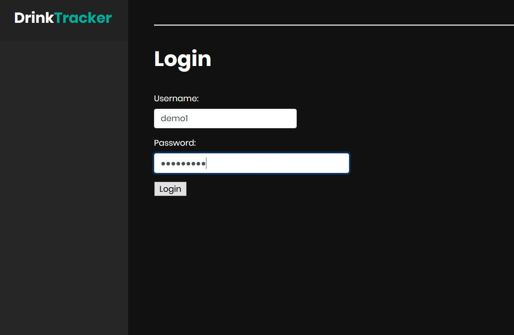
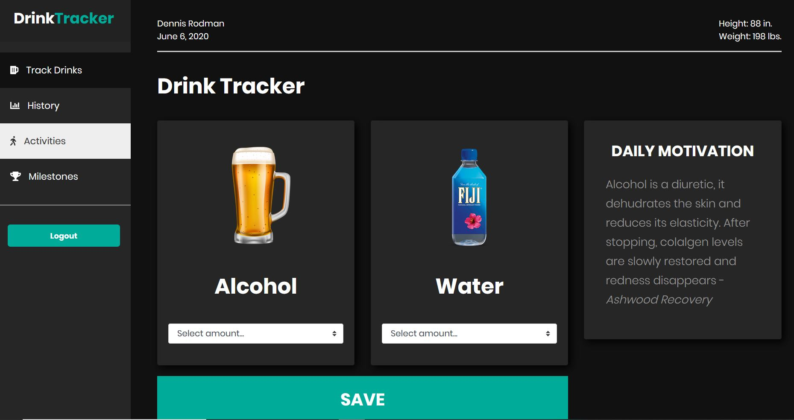
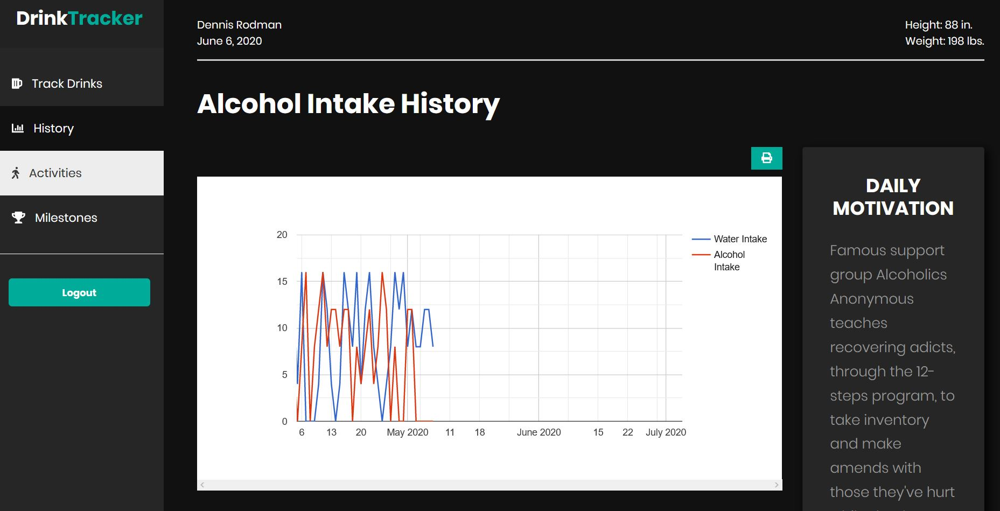
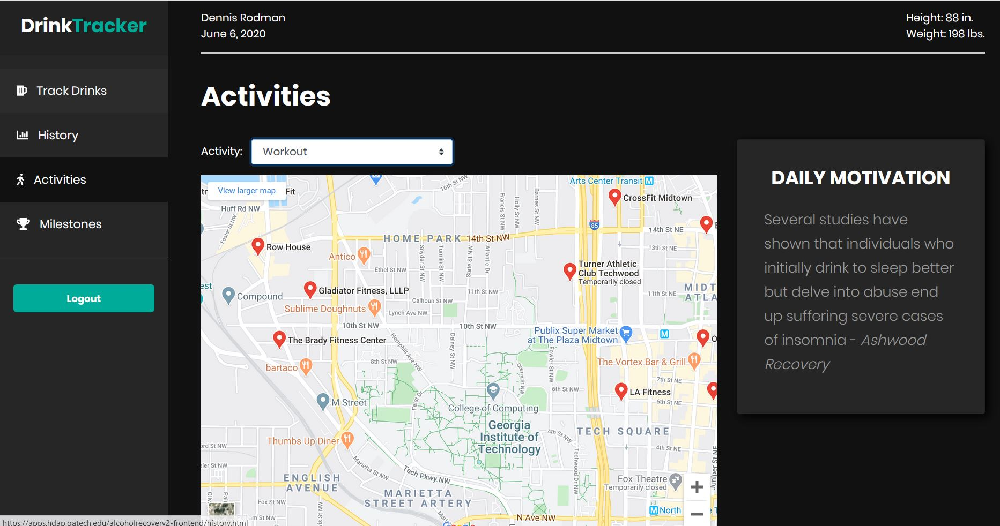
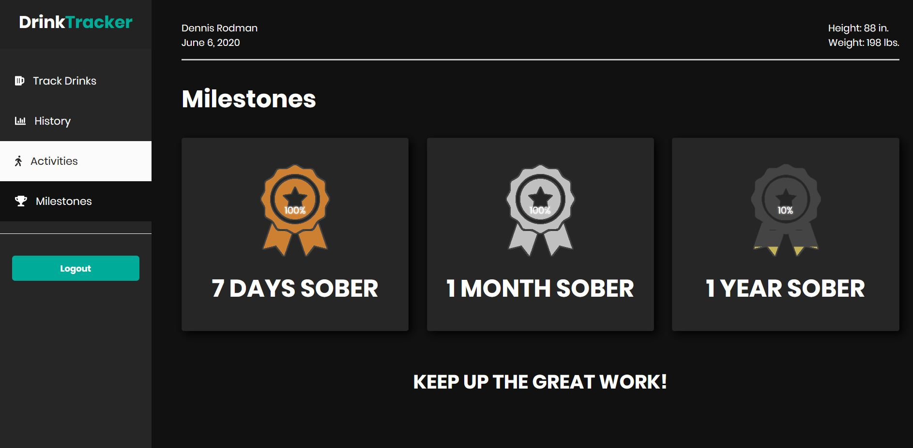

## **1 Introduction:**

Our project is to design an assistive web application for those recovering from alcohol addiction. The application will provide the ability to track alcohol intake as well as motivate patients and communicate with their physician.

## **2 Process Description:**

**Patient Stat Monitoring and Management**

The application will obtain, use, and manage input from users and their health records through FHIR. Users will need the functionality to be able to input their alcohol consumption on a regular basis in order to track their progress. The application will also utilize patient statistics through FHIR to formulate the most beneficial experience for users.

Entrance criteria: Input from user and statistics through FHIR

Exit criteria: An efficient database system which will manage this data. Users can provide feedback if the app performs poorly and are experiencing high latency.

**Motivate User**

A primary function of the application is to also motivate users on the road to recovery. One form of motivation the application will offer is sending positive messages to appease users. Another method of motivation the application possesses is displaying metrics. These will serve as visuals to the users to reinforce to them that they are on the right track.

Entrance criteria: Regular input from user logging alcohol consumption

Exit criteria: Motivational messages through notifications and graphs that will visualize the user&#39;s progress. Users can provide feedback on whether these forms of motivation were effective.

**Advise User**

The application will also require the functionality of providing alternatives to users when they want to relapse. Our application will need to suggest activities within proximity of the user such as exercising at the gym, visiting a park, etc.

Entrance criteria: Input from the user when they feel they have to relapse as well as their geolocation

Exit criteria: Motivational messages through notifications and graphs that will visualize the user&#39;s progress. Users can provide feedback on whether these suggestions of alternatives were beneficial

**Communicate with Physician**

The alcohol recovery application will also need to communicate with the user&#39;s doctor to allow them to track their patient&#39;s progress. This will be done regularly through an email which will summarize the weekly metrics of the patient/user.

Entrance criteria: Metrics derived from regular user logs on alcohol consumption

Exit criteria: An email containing metrics and summarizing the progress of the user. Physicians can communicate feedback potentially requesting additional information about their patient if unsatisfied with the content within the email.

## App Functionalities:

**Login**

The app allows user to login using a unique user name and password. The user's Health data is fetched from FHIR server like weight, height, pre existing conditions etc.

**Drink Tracker**

 
A very crucial functionality is to track the amount of alcohol consumed by the user on a daily basis. This will motivate them as they can see their progress, or be cautious if they see an increasing consumption of alcohol.
 

 
The tracker projects charts and the trajectory of their recovery so far.
Customized Motivational facts are displayed that will help users to stick to their routine
 
**Suggest activities**

 
Relapse in recovery patients is quite common. So this page will suggest user activities or events nearby using zip code/ coordinates.  
 
**Milestones**
 

 
The Milestones will act as motivation for the user to keep going. They can earn badges along the way. The main idea is to have a goal setting in their mind.
 

## ** Team:**

**·         Connor Beveridge (Quality Assurance/Developer)**

**·         Kavin Krishnan (Project Manager)**

**·         Pranit Kaul (Developer)**

**·         Tyler Roland (Developer)**

**·         Neeraj Sabapathy (Project Manager)**

**·         Brian Foxx (Developer)**
